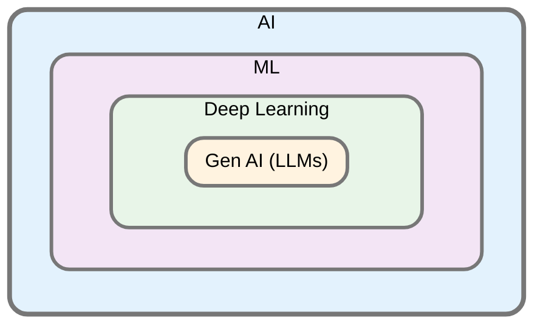
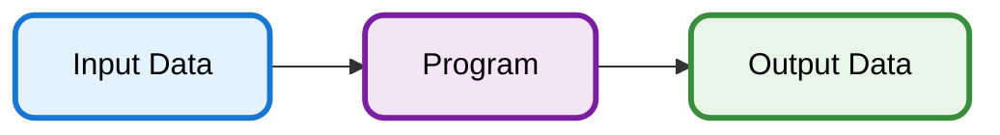

# Overview of AI and ML

Artificial Intelligence (AI) is the broadest field, encompassing Machine Learning (ML), which focuses on learning from data. Deep Learning (DL) is a specialized ML branch using neural networks to analyze complex patterns. Generative AI, including large language models (LLMs), is a subset of DL centered on creating new content. The following figure shows how these disciplines are nested within each other.



## Data Sets and Programs

Briefly, in computing, a *program* takes in *input data* and puts outs *output data*.



In conventional computing, the program is written by a human. In AI however, the program is generated by a machine, using *machine learning* that works on examples (data).


## Agents = Intelligent Software running on a Hardware Device 

Agents are artifacts consisting of (1) intelligent software which runs on (2) some hardware device. 

Agents can be written (generated) either by a human programmer or by a machine (in the latter case, we are dealing with *machine learning*). 

In the remainder of this book, we will call an AI program running on a hardware, to be an *agent*. We can thus write the following to capture the notion that an "agent" is a combination of hardware and software:

```
agent = hardware + intelligent software
```

For example, an agent may be:
- an instance of inteligent software running on an ordinary PC, or 
- an instance of inteligent software running on a robot hardware.

In the first case, the agent can process input data, and output some data. In the second case, the agent can even move around, since robot hardware offers physical movement capabilities as well. 


### Examples of Agents

#### Plant Watering Robot

In this world model, plants that can be "dry" or "wet." The watering agent (which consists of a hardware robot that moves between rooms containing plants, and the program running on this robot) perceives if the current plant needs water. 

```
agent = robot hardware + plant_watering_agent() function
```

The actions are to water the plant, move to another plant, or do nothing. A simple agent tries to water any dry plant it currently detects; if none are dry, it moves to the next plant.

```python
def plant_watering_agent(plant_status, current_position):
    """
    plant_status: dictionary with plant positions as keys and 'dry' or 'wet' as values
    current_position: current plant position of the agent (e.g., 'plant1')
    
    Returns: action string like "water plant1", "move to plant2", or "do nothing"
    """
    # List of plants to check in order
    plants = list(plant_status.keys())
    
    # If current plant is dry, water it
    if plant_status[current_position] == 'dry':
        return f"water {current_position}"
    
    # Otherwise, look for next dry plant
    for plant in plants:
        if plant_status[plant] == 'dry' and plant != current_position:
            return f"move to {plant}"
    
    # If no dry plants found, do nothing
    return "do nothing"

# Example usage:
plants = {'plant1': 'wet', 'plant2': 'dry', 'plant3': 'wet'}
current_pos = 'plant1'

action = plant_watering_agent(plants, current_pos)
print(action)  # Output: move to plant2
```


#### Search Agent

These agents operate in a space of *states*. The agents can move from one state to another in this space. Formally, this space of states can be represented as a set-theoretical graph whose nodes represent states, and edges between nodes represents allowable transitions between states.

```
agent = computer hardware + search function
```

An agent starts from a special starting state (called *initial* state), and has to reach any of the *goal states*, while minimizing the total cost.

Example: how to reach Los Angeles by car from New York? Imagine an AI agent driving a car. The agent would have to conduct search to find the cheapest (or fastest, or both) route from New York to Los Angeles. 