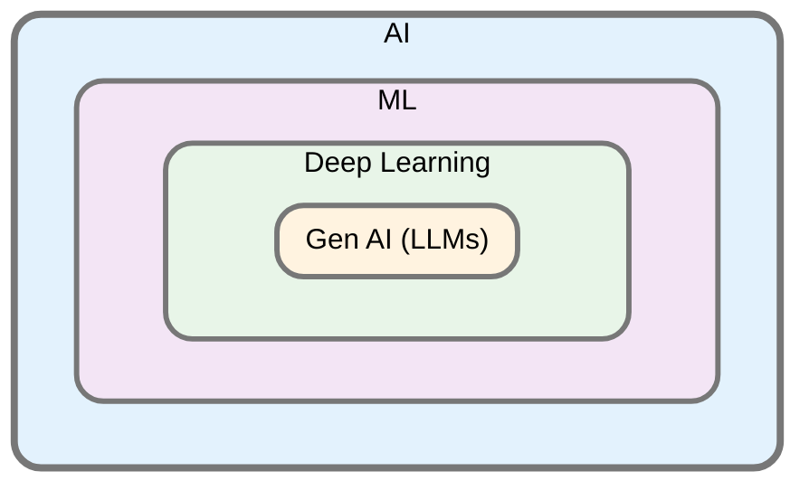
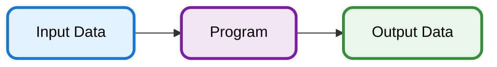

# Overview of AI and ML

Artificial Intelligence (AI) is the broadest field, encompassing Machine Learning (ML), which focuses on learning from data. Deep Learning (DL) is a specialized ML branch using neural networks to analyze complex patterns. Generative AI, including large language models (LLMs), is a subset of DL centered on creating new content. The following figure shows how these disciplines are nested within each other.

In conventional computing, a human-written program accepts input data and processes it to generate output data:

In ML however, we use input data AND output data to generate the program:
