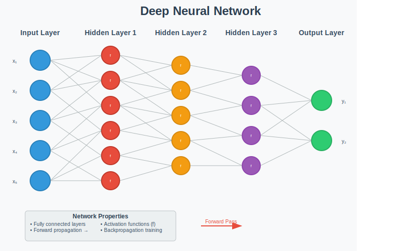

# What Are LLMs

Among many types of intelligent (AI) software, Large Language Models (LLMs) are currently the most prominent AI modules being used. An LLM is a type of artificial intelligence program (an artificial neural network) that uses deep learning techniques to understand, generate, and predict human language. 

An LLM is trained on massive amounts of text data, allowing it to perform various natural language processing tasks such as answering questions, writing text, and translating languages. 

LLMs are built using neural networks called *transformers*, which enable them to capture context and complex relationships in language efficiently. Examples include GPT and Claude.

In this chapter, we focus on high-level aspects of LLMs, such as characteristics of LLM, how to deploy and use LLMs, and so on. For low-level technical details of LLMs, we refer the reader to existing texts such as [][][][].

## The Inner Architecture of LLMs

What is the inner makeup of LLMs? Large Language Models (LLMs) are built primarily on the **Transformer architecture**, which is a deep neural network designed to process sequences of text in parallel. The two main components of a Transformer LLM are an *encoder* and a *decoder*:

- **Encoder**. The encoder's job is to understand the input. It reads the text (like an English sentence) and converts it into a set of numerical codes that capture its full meaning and context.

- **Decoder**. The decoder's job is to generate the output. It takes those numerical codes from the encoder and uses them to produce the final result (like the French translation of that sentence).

### Encoder

The encoder produces vector embeddings - those "numerical representations" or "number patterns" mentioned above, and are specifically called vector embeddings. These embeddings are lists of numbers (vectors) where each number represents different aspects of meaning, context, and relationships between words. For example, a single word might be represented by a vector with hundreds of values, where different positions in that vector capture things like:

- The word's semantic meaning
- Its grammatical role in the sentence
- How it relates to other words nearby
- Context from the surrounding text

What makes transformer encoders special is that they create contextual embeddings - meaning the same word gets different vector representations depending on the context it appears in. For instance, the word "bank" would have different embeddings in "river bank" versus "savings bank" because the encoder considers the surrounding words when creating these vectors.

Therefore, the encoder's job is to transform text into these rich vector embeddings that capture all the contextual meaning, which the decoder can then use to generate appropriate output text.

### Decoder

The decoder takes those vector embeddings from the encoder and converts them back into human-readable text, but it does this in a very specific way:

**Sequential Generation:** Unlike the encoder which processes all input words at once, the decoder generates output text one word at a time, from left to right. It's like writing a sentence where you have to decide each next word based on what you've already written.

**Three Key Steps for Each Word:**
1. **Looks at what it's already generated** - It considers all the words it has produced so far in the output sequence
2. **References the encoder's embeddings** - It pays attention to relevant parts of the input (this is called "cross-attention")
3. **Predicts the next word** - Based on steps 1 and 2, it calculates probabilities for what the next word should be and picks the most likely one

**Example in translation:**
- Encoder embeddings represent: "Hello, how are you?"
- Decoder generates step by step:
  - Step 1: Produces "Hola" (looking at encoder embeddings)
  - Step 2: Produces "," (considering "Hola" + encoder embeddings)  
  - Step 3: Produces "¿cómo" (considering "Hola," + encoder embeddings)
  - And so on...

This sequential process continues until the decoder decides the sentence is complete (usually by generating a special "end" token).

The key insight is that the decoder is essentially a sophisticated "next word predictor" that uses both the input context (from encoder) and its own previous outputs to generate coherent text.