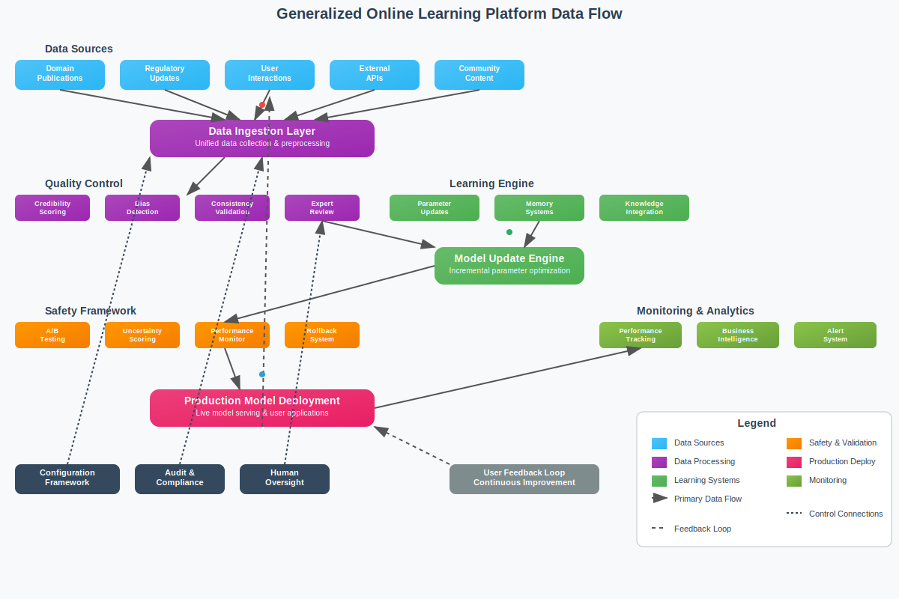

# Online Learning

Differently from the development model where a new version of an LLM is created anew, there is another model of revising (upgrading) LLMs based on the notion of *online learning*.

Online learning for LLMs refers to the process where an LLM continues to learn and update its parameters incrementally as it receives new data, rather than being trained once and fixed. This ongoing learning approach allows the model to adapt in real-time to new information, user behavior, or changing environments without the need for full retraining from scratch. It helps maintain and improve model performance by incorporating fresh data continuously, which is especially useful for applications requiring up-to-date knowledge or personalization. 

Online learning can involve techniques such as fine-tuning on streaming data, reinforcement learning from user feedback, or incremental training batches. This contrasts with traditional offline learning where the model is trained once on a static dataset and then deployed. Online learning enables LLMs to stay relevant, aligned, and effective over time in dynamic real-world scenarios.

=====

## Generalized Framework for Implementing Online Learning

Here's a generalized framework for implementing online learning in any AI cloud platform.

### Universal Data Ingestion Pipeline

**Multi-Source Data Streams**
- Domain-specific publication feeds and databases
- Regulatory/standards updates relevant to the field
- User interaction logs and feedback patterns
- Real-time external APIs and data sources
- Community-generated content and corrections
- Industry-specific news and trend feeds

**Universal Quality Filtering**
- Source credibility scoring based on domain-specific authority metrics
- Expert review workflows with configurable approval thresholds
- Bias detection and fact-checking algorithms adapted to the field
- Consistency validation against existing knowledge base
- Spam and adversarial content detection

### Adaptive Learning Architecture

**Flexible Parameter Update Strategies**
- Configurable regularization techniques (EWC, L2, dropout) to prevent catastrophic forgetting
- Modular architecture with domain-specific adapter layers
- Meta-learning approaches for rapid adaptation to new sub-domains
- Selective parameter updating based on confidence and validation scores

**Knowledge Integration Framework**
- Experience replay systems storing important historical examples
- Progressive knowledge distillation from periodically retrained teacher models
- Memory-augmented architectures for critical domain facts
- Multi-task learning balancing new information with foundational knowledge

### Safety and Validation System

**Domain-Agnostic Quality Assurance**
- Configurable expert validation pipelines
- Automated A/B testing comparing updated vs. baseline model performance
- Uncertainty quantification and confidence scoring for new information
- Performance monitoring on domain-specific benchmarks and test suites

**Compliance and Governance**
- Privacy-preserving techniques (differential privacy, federated learning)
- Comprehensive audit logging and model versioning
- Rollback capabilities with automated performance degradation detection
- Domain-specific regulatory compliance modules (HIPAA, GDPR, SOX, etc.)

### Customization and Personalization

**Organization-Specific Adaptation**
- Custom terminology, jargon, and workflow integration
- Regional/cultural pattern recognition and adaptation
- Integration with organization-specific tools and databases
- Department/team-specific fine-tuning capabilities

**User-Centric Learning**
- Individual user preference learning and adaptation
- Feedback incorporation with weighted importance scoring
- Communication style and format preference adaptation
- Trust-building through transparent update explanations

### Scalable Technical Infrastructure

**Platform Architecture**
- Microservices-based design for independent component scaling
- Event-driven update pipelines with configurable latency requirements
- Distributed computing with auto-scaling based on update volume
- Multi-region deployment with data locality considerations

**Update Management System**
- Priority-based update scheduling (critical, high, medium, low)
- Configurable update frequencies per data type and source
- Staged rollout mechanisms with canary deployments
- Automated validation gates before production deployment

### Configuration Framework

**Domain Customization**
- Field-specific knowledge validation rules
- Custom evaluation metrics and success criteria
- Configurable data source priorities and trust levels
- Domain expert role definitions and approval workflows

**Learning Parameters**
- Adjustable learning rates and update frequencies
- Customizable memory retention and forgetting policies
- Configurable model architecture components
- Flexible evaluation and testing protocols

### Monitoring and Analytics

**Performance Tracking**
- Real-time model performance dashboards
- Knowledge drift detection and alerting
- User satisfaction and engagement metrics
- Comparative analysis against static baselines

**Business Intelligence**
- Usage pattern analysis and optimization recommendations
- ROI measurement for continuous learning investments
- Trend identification and predictive insights
- Cost optimization through efficient update scheduling

This generalized framework allows any AI platform to implement online learning by configuring the domain-specific components while leveraging the universal infrastructure and safety mechanisms. The key is maintaining flexibility in the configuration layer while ensuring robust, safe operation across all domains.

=====

## Overall Architecture

This comprehensive system architecture diagram illustrates how a cloud platform implementing the generalized online learning framework would be structured. Here are the key architectural components:

### Layered Architecture Overview

**1. User Layer (Top)**
- Multiple interface types: Web, mobile, APIs, dashboards, admin portals
- Support for external systems, domain experts, and IoT devices
- Comprehensive access points for all stakeholders

**2. API Gateway & Load Balancer Layer**
- Centralized entry point with authentication, authorization, and rate limiting
- SSL termination, request routing, and circuit breaker patterns
- Comprehensive logging and analytics for all requests

**3. Microservices Layer**
- Domain-specific services: User management, model serving, configuration
- Cross-cutting concerns: Workflow orchestration, expert review, monitoring
- Audit & compliance, notifications, and analytics services

**4. Data Processing & Quality Control Layer**
- Real-time and batch data ingestion with comprehensive validation
- Multi-stage quality filtering, transformation, and security measures
- Data lineage tracking and metadata management

**5. Machine Learning & Online Learning Layer**
- Core online learning components: Model update engine, memory systems
- Safety framework with A/B testing and uncertainty quantification
- MLOps pipeline with experiment tracking and automated deployment

**6. Storage & Data Layer**
- Multi-modal storage: Object storage, relational, time series, document, graph
- Caching layer and message queuing for performance
- Search capabilities for analytics and discovery

**7. Infrastructure & Operations Layer**
- Container orchestration with Kubernetes and Docker
- Auto-scaling, service mesh, and comprehensive observability
- Multi-cloud support with robust backup and disaster recovery

### Key Architectural Features

**Scalability**: Horizontal scaling at every layer with auto-scaling capabilities and load balancing

**Resilience**: Circuit breakers, rollback mechanisms, backup systems, and multi-region deployment

**Security**: End-to-end encryption, RBAC, network policies, and compliance frameworks

**Observability**: Comprehensive monitoring, logging, tracing, and real-time performance indicators

**Flexibility**: Modular microservices architecture allowing independent scaling and updates

**Safety**: Multiple validation gates, A/B testing, and rollback capabilities for safe online learning

The animated indicators show real-time data flow through the system, emphasizing the continuous nature of online learning. The feedback loops (shown in red dashed lines) illustrate how user interactions and system performance continuously improve the platform through the online learning framework.

This architecture can be adapted to any domain by customizing the specific services, data sources, validation rules, and compliance requirements while maintaining the core online learning capabilities.

## Case Study: `MediLearn` Assistant

`MediLearn` assistant is a hypothetical healthcare-focused platform that continuously incorporates new medical research, drug approvals, treatment guidelines, and clinical trial results. As medical professionals use the system, it learns from their queries and feedback to better understand emerging medical terminology, treatment protocols, and diagnostic patterns while maintaining strict privacy controls.

Here's how MediLearn Assistant could implement online learning for its healthcare LLM platform:

### Data Ingestion Pipeline

**Continuous Data Streams**
- Real-time feeds from medical journals (PubMed, NEJM, Lancet)
- FDA drug approvals and safety alerts
- Clinical trial databases and results
- Medical coding updates (ICD-10, CPT)
- Professional medical society guidelines
- Anonymized query patterns and user feedback

**Quality Filtering**
- Automated credibility scoring based on publication source, peer review status, and citation metrics
- Medical expert review queues for controversial or high-impact updates
- Bias detection algorithms to identify potential conflicts of interest
- Consistency checks against established medical knowledge

### Incremental Learning Architecture

**Parameter Update Strategy**
- Elastic Weight Consolidation (EWC) to prevent catastrophic forgetting of established medical knowledge
- Task-specific adapter layers that can be updated without affecting core medical reasoning
- Gradient-based meta-learning for rapid adaptation to new medical domains
- Selective parameter freezing for well-established medical facts

**Knowledge Integration Methods**
- Continual learning through experience replay of important historical medical cases
- Progressive knowledge distillation from larger, batch-updated teacher models
- Memory-augmented networks storing critical medical facts and recent updates
- Multi-task learning balancing new information with foundational medical knowledge

### Safety and Validation Framework

**Medical Accuracy Safeguards**
- Multi-expert validation for any updates affecting diagnostic or treatment recommendations
- A/B testing framework comparing updated model responses against established guidelines
- Confidence scoring and uncertainty quantification for new medical information
- Rollback mechanisms for updates that degrade performance on medical benchmarks

**Regulatory Compliance**
- HIPAA-compliant data handling with differential privacy techniques
- Audit trails tracking all model updates and their sources
- Version control allowing inspection of model state at any point in time
- Separate learning streams for different medical specialties to prevent cross-contamination

### Personalization and Adaptation

**Institution-Specific Learning**
- Hospital-specific terminology, protocols, and workflow adaptation
- Regional disease pattern recognition and treatment preference learning
- Integration with local formularies and available treatment options
- Specialty-specific fine-tuning for different medical departments

**User Interaction Learning**
- Learning from physician feedback on response quality and relevance
- Adapting to individual physician communication styles and preferences
- Incorporating corrections and clarifications provided by medical professionals
- Building user trust through transparent explanation of knowledge updates

### Technical Implementation

**Infrastructure Requirements**
- Low-latency update pipelines for critical medical alerts
- Distributed computing clusters for parallel model updates
- Edge deployment for reduced latency in clinical settings
- Redundant systems ensuring high availability for medical applications

**Update Scheduling**
- Immediate updates for drug recalls or safety alerts
- Daily updates for new research findings and clinical guidelines
- Weekly comprehensive model validation and testing cycles
- Monthly major version releases with extensive clinical validation

This approach would allow MediLearn Assistant to stay current with rapidly evolving medical knowledge while maintaining the safety, accuracy, and reliability standards required for healthcare applications.