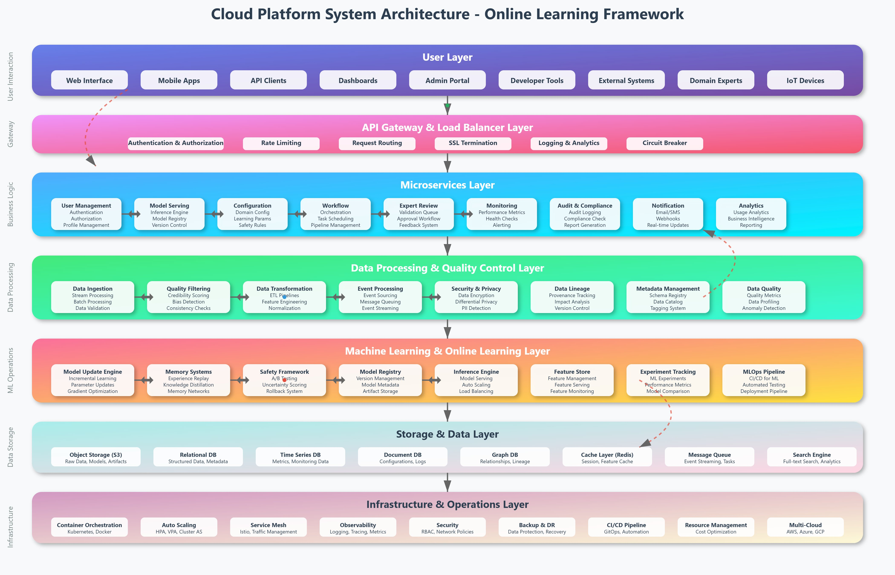

# AI Platforms

Implementing online learning for LLMs in an AI cloud platform involves several integrated components designed for continuous, scalable, and efficient model updating:

1. **Data Pipeline and Streaming:** The platform continuously collects new relevant data streams from user interactions, feedback, logs, and external sources. This data is cleaned, preprocessed, and prepared for incremental training batches.

2. **Incremental Training and Fine-tuning:** Instead of retraining the entire model from scratch, the platform performs incremental updates or fine-tuning where only parts of the LLM weights are adjusted based on the new data. This reduces computational cost and enables faster adaptation.

3. **Model Versioning and Registry:** Each updated model version is stored with metadata for traceability, rollback, and experiment tracking. Cloud-native model registries or artifact stores enable seamless deployment through APIs.

4. **Automated Training Orchestration:** MLOps pipelines orchestrate training, evaluation, and validation workflows automatically upon new data ingestion to ensure quality and compliance.

5. **Evaluation and Monitoring:** Continuous evaluation is done using benchmark tasks and live metrics tracking error rates, bias, hallucinations, and resource usage to ensure that updates improve or at least maintain model quality.

6. **Deployment and Serving:** Updated models are deployed with zero-downtime strategies to handle online traffic. Some platforms support multi-version serving, allowing gradual rollout and A/B testing.

7. **Scaling and Resource Optimization:** Leveraging elastic cloud compute resources like GPUs or TPUs, the platform dynamically scales to balance cost, latency, and throughput.

This approach ensures that LLMs stay relevant and personalized while leveraging cloud infrastructure's robustness, scalability, and automation capabilities.

## Overall Architecture

This comprehensive system architecture diagram illustrates how a cloud platform implementing the generalized online learning framework would be structured. Here are the key architectural components:

**1. User Layer (Top)**
- Multiple interface types: Web, mobile, APIs, dashboards, admin portals
- Support for external systems, domain experts, and IoT devices
- Comprehensive access points for all stakeholders

**2. API Gateway & Load Balancer Layer**
- Centralized entry point with authentication, authorization, and rate limiting
- SSL termination, request routing, and circuit breaker patterns
- Comprehensive logging and analytics for all requests

**3. Microservices Layer**
- Domain-specific services: User management, model serving, configuration
- Cross-cutting concerns: Workflow orchestration, expert review, monitoring
- Audit & compliance, notifications, and analytics services

**4. Data Processing & Quality Control Layer**
- Real-time and batch data ingestion with comprehensive validation
- Multi-stage quality filtering, transformation, and security measures
- Data lineage tracking and metadata management

**5. Machine Learning & Online Learning Layer**
- Core online learning components: Model update engine, memory systems
- Safety framework with A/B testing and uncertainty quantification
- MLOps pipeline with experiment tracking and automated deployment

**6. Storage & Data Layer**
- Multi-modal storage: Object storage, relational, time series, document, graph
- Caching layer and message queuing for performance
- Search capabilities for analytics and discovery

**7. Infrastructure & Operations Layer**
- Container orchestration with Kubernetes and Docker
- Auto-scaling, service mesh, and comprehensive observability
- Multi-cloud support with robust backup and disaster recovery

### Key Architectural Features

**Scalability**: Horizontal scaling at every layer with auto-scaling capabilities and load balancing

**Resilience**: Circuit breakers, rollback mechanisms, backup systems, and multi-region deployment

**Security**: End-to-end encryption, RBAC, network policies, and compliance frameworks

**Observability**: Comprehensive monitoring, logging, tracing, and real-time performance indicators

**Flexibility**: Modular microservices architecture allowing independent scaling and updates

**Safety**: Multiple validation gates, A/B testing, and rollback capabilities for safe online learning

The animated indicators show real-time data flow through the system, emphasizing the continuous nature of online learning. The feedback loops (shown in red dashed lines) illustrate how user interactions and system performance continuously improve the platform through the online learning framework.

This architecture can be adapted to any domain by customizing the specific services, data sources, validation rules, and compliance requirements while maintaining the core online learning capabilities.