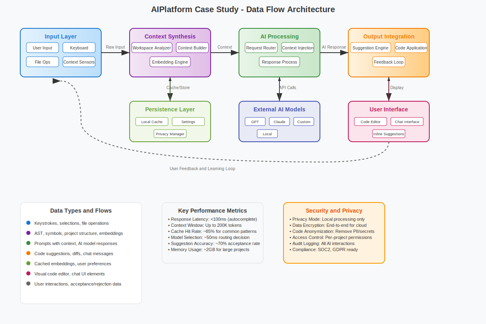
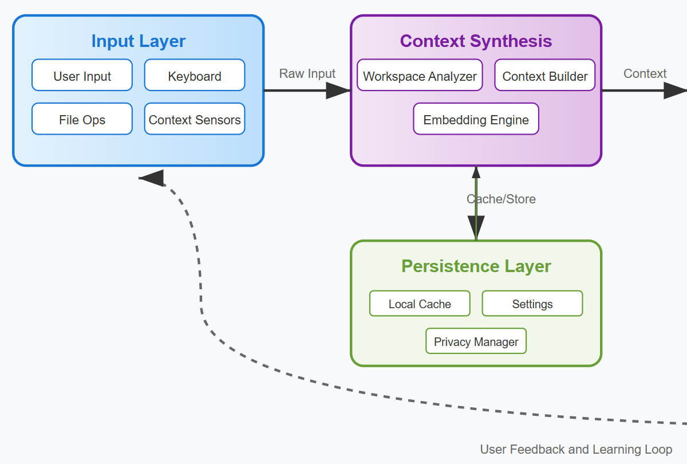
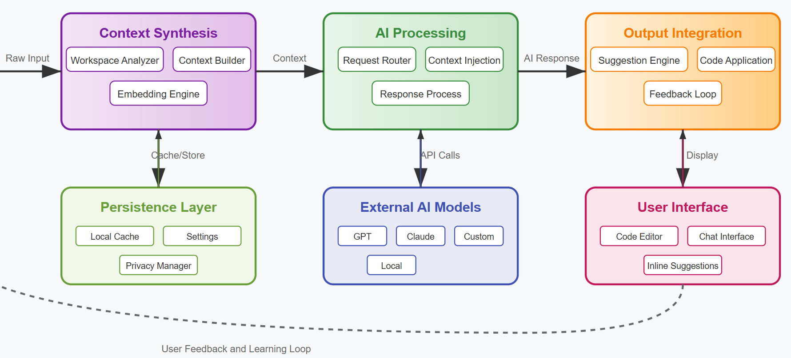

# An AI Platform: Case Study

In this case study, we propose an architecture for a platform named `AIPlatform` that consists of an AI-native content editor structured around LLM integration, creating a seamless human-AI collaborative content editing environment.

## LLM Integration Architecture

**Multi-Model Backend**

`AIPlatform` integrates multiple LLMs offered by AI vendors, and custom models optimized for content generation. The platform intelligently routes requests based on the specific content editing task - using faster models for autocomplete and more capable models for complex refactoring or architecture discussions. Model selection happens transparently based on context, file types, and user preferences.

**Contextual Content Base Understanding**

The editor maintains a sophisticated understanding of the entire content base through indexed embeddings and semantic analysis. When users interact with the AI, `AIPlatform` automatically includes relevant context from the current file, related modules, imported dependencies, and project structure. This eliminates the need for users to manually provide context, making AI interactions feel native to the content editing experience.

## Core Interaction Paradigms

**Inline AI Assistance**

The primary interface integrates AI directly into the content editor through natural language prompts. Users can highlight source code and ask for explanations, refactoring, or modifications using Ctrl+K, with responses appearing inline or as suggested edits. The AI can read and modify source code across multiple files simultaneously while maintaining awareness of the broader project context.

**Predictive Autocomplete**

Beyond traditional autocomplete, `AIPlatform` editor provides multi-line code predictions that understand content editing patterns, project conventions, and user intent. The system learns from the current content base to suggest contextually appropriate completions, from single lines to entire functions, adapting to the project's specific content editing style and architecture.

**Conversational Debugging**
A
 chat interface allows users to discuss source code issues, architectural decisions, and implementation strategies with AI assistance. The chat maintains awareness of the current source code context, recent changes, and can directly suggest or implement modifications based on the conversation.

## Technical Implementation

**Real-Time Context Synthesis**

`AIPlatform` editor continuously analyzes the workspace to build dynamic context for AI interactions. This includes tracking cursor position, recent edits, imported modules, and relevant documentation. The system uses retrieval-augmented generation to pull in the most relevant code snippets and documentation when processing AI requests.

**Efficient Caching and Streaming**
The platform implements sophisticated caching mechanisms to reduce latency and API costs. Common patterns, frequently accessed source code segments, and partial completions are cached locally. Streaming responses provide immediate feedback for longer AI-generated code blocks, allowing developers to review and accept suggestions progressively.

**Privacy-Preserving Design**
`AIPlatform` offers both cloud-based and privacy mode options. In privacy mode, sensitive code never leaves the local environment, with AI processing happening through carefully anonymized context or local model inference. This addresses enterprise security concerns while maintaining AI functionality.

## Development Workflow Integration

**Project-Aware Intelligence**
The AI understands project structure, build systems, and dependencies, enabling it to suggest appropriate imports, follow project conventions, and maintain consistency across files. When making changes, the AI considers the broader impact on the project content base and can proactively suggest related modifications.

**Version Control Integration**
`AIPlatform` integrates with Git workflows, understanding commit history and branch context. The AI can explain changes, suggest commit messages, review diffs, and help resolve merge conflicts by understanding the intent behind code modifications.

**Testing and Documentation Assistance**
The platform can automatically generate tests, documentation, and code comments based on implementation context. It understands testing frameworks used in the project and generates appropriate test cases while maintaining consistency with existing patterns.

## Performance and Scalability

**Hybrid Processing Architecture**
`AIPlatform` balances cloud-based AI capabilities with local processing for performance-critical features. Simple autocomplete and syntax highlighting happen locally, while complex code generation and analysis leverage cloud models. This hybrid approach ensures responsive interaction while accessing powerful AI capabilities.

**Adaptive Resource Management**
The editor intelligently manages computational resources, adjusting AI assistance intensity based on system performance and user activity. During intensive content editing sessions, the platform optimizes response times and reduces background processing to maintain smooth editor performance.

The architecture creates a content editing environment where AI assistance feels native rather than bolted-on, enabling developers to leverage powerful language models through intuitive interactions while maintaining the performance and reliability expected from professional development tools.

=========

## Data Flow Description

The `AIPlatform` editor and platform implements a sophisticated multi-layered data flow that seamlessly integrates AI capabilities with traditional code editing workflows.

#### Input Layer
**User Interactions** flow through multiple channels: direct text input in the editor, keyboard shortcuts (Ctrl+K for inline AI, Ctrl+L for chat), mouse selections for code highlighting, and file operations like opening, saving, and navigation. **Contextual Sensors** continuously capture workspace state including cursor position, active files, recent edits, and project structure changes.

### Context Synthesis Layer
The **Workspace Analyzer** continuously processes the current codebase, building semantic understanding through AST parsing, dependency analysis, and symbol resolution. **Context Builder** aggregates relevant information for AI requests, including current file content, related modules, project conventions, and user coding patterns. **Embedding Engine** maintains vector representations of code segments for efficient similarity search and context retrieval.

### AI Processing Layer
**Request Router** intelligently selects appropriate models based on task complexity - lightweight models for autocomplete, powerful models for complex generation. **Context Injection** combines user prompts with synthesized workspace context before sending to AI models. **Response Processing** handles streaming AI responses, parsing code suggestions, and formatting output for editor integration.

### Output Integration Layer
**Suggestion Engine** presents AI-generated code as inline suggestions, diff views, or chat responses. **Code Application** handles accepting/rejecting suggestions with atomic operations and undo capability. **Feedback Loop** captures user interactions with AI suggestions to improve future recommendations.

### Persistence Layer
**Local Cache** stores frequently accessed embeddings, model responses, and workspace analysis for performance optimization. **Settings & Preferences** maintain user configuration, model preferences, and project-specific settings. **Privacy Manager** ensures sensitive data handling based on user privacy settings.

## Key Data Flow Patterns

### Real-Time Autocomplete Flow
User typing triggers immediate context analysis, lightweight model inference for predictions, and streaming suggestions back to the editor within 100ms. The system maintains a rolling context window and caches frequent patterns to minimize latency.

### Complex Generation Flow  
Ctrl+K prompts initiate deeper workspace analysis, comprehensive context gathering from multiple files, routing to powerful models (GPT-4/Claude), and structured response processing with diff generation and user review interfaces.

### Learning and Adaptation Flow
User acceptance/rejection of suggestions feeds back into the system, updating local caching strategies, refining context selection algorithms, and improving model routing decisions for similar future scenarios.

The architecture prioritizes low-latency user experience while maintaining the context richness necessary for high-quality AI assistance, balancing local processing for performance with cloud capabilities for advanced AI functionality.

=========

## MLOps Implementation

`AIPlatform` implements MLOps practices tailored specifically for AI-native development tools, focusing on continuous model improvement, performance optimization, and seamless integration with the coding experience.

### Model Lifecycle Management

**Multi-Model Orchestration**
`AIPlatform` manages multiple model versions simultaneously, including different sizes of GPT models, Claude variants, and custom fine-tuned models optimized for code generation. The platform implements blue-green deployments for model updates, allowing seamless switching between model versions without service interruption. A/B testing infrastructure continuously evaluates new models against existing ones using real user interactions and coding task success rates.

**Automated Model Selection**
The system uses a sophisticated routing layer that selects optimal models based on task characteristics, user context, and performance requirements. Lightweight models handle autocomplete and syntax suggestions, while larger models process complex refactoring and architectural discussions. The routing decisions are continuously optimized based on latency, accuracy, and cost metrics.

### Continuous Integration/Continuous Deployment (CI/CD)

**Model Training Pipelines**
`AIPlatform` implements automated training pipelines that continuously process anonymized user interaction data to improve model performance. These pipelines include data validation, quality checks, and automated retraining triggers based on performance degradation or new data availability. Custom models are fine-tuned on code-specific tasks using techniques like instruction tuning and reinforcement learning from human feedback.

**Gradual Rollout System**
New model versions are deployed through a staged rollout process, starting with internal testing, progressing to beta users, and finally reaching general availability. The system monitors key metrics including suggestion acceptance rates, user satisfaction, and error rates during each stage, with automatic rollback capabilities if performance degrades.

**Feature Flag Management**
MLOps infrastructure includes comprehensive feature flagging for AI capabilities, allowing selective enablement of new models or features for specific user segments. This enables controlled experimentation and risk mitigation while gathering performance data.

### Performance Monitoring & Observability

**Real-Time Metrics Dashboard**
`AIPlatform` maintains comprehensive monitoring of AI system performance including model inference latency, suggestion acceptance rates, user engagement metrics, and system resource utilization. Custom metrics track code-specific quality measures like syntactic correctness, contextual relevance, and coding pattern adherence.

**Model Drift Detection**
Automated systems continuously monitor for model performance degradation or drift, comparing current performance against established baselines. This includes tracking changes in user acceptance patterns, error rates, and semantic quality of generated code across different programming languages and frameworks.

**User Experience Analytics**
Advanced analytics track how AI assistance impacts developer productivity, including metrics like code completion speed, debugging efficiency, and feature adoption rates. These insights inform model improvement priorities and feature development decisions.

### Data Pipeline Architecture

**Privacy-Preserving Data Collection**
MLOps infrastructure includes sophisticated data collection mechanisms that respect user privacy while gathering necessary training data. This involves automatic anonymization, PII detection and removal, and configurable privacy levels including local-only processing modes.

**Data Quality Assurance**
Automated data validation ensures training data quality through syntactic correctness checking, semantic analysis, and filtering of low-quality code samples. The system maintains data lineage tracking and version control for training datasets.

**Real-Time Feature Engineering**
The platform processes user interactions in real-time to extract relevant features for model improvement, including coding patterns, error correction behaviors, and contextual preferences. These features feed into continuous learning systems that adapt model behavior.

### Infrastructure & Scaling

**Hybrid Cloud Architecture**
`AIPlatform` implements a hybrid deployment model with cloud-based training and inference for powerful models, combined with local processing for privacy-sensitive operations and low-latency features. Edge caching and model compression techniques optimize performance across different deployment scenarios.

**Auto-Scaling Systems**
MLOps infrastructure includes intelligent auto-scaling based on user activity patterns, automatically provisioning additional compute resources during peak usage while optimizing costs during low-demand periods. The system maintains separate scaling policies for different model types and use cases.

**Resource Optimization**
Advanced resource management optimizes GPU utilization across multiple models and user requests, implementing efficient batching, caching strategies, and model sharing techniques to maximize throughput while minimizing infrastructure costs.

### Quality Assurance & Testing

**Automated Testing Frameworks**
Comprehensive testing infrastructure validates model outputs across diverse coding scenarios, including unit test generation, code explanation accuracy, and refactoring correctness. The system maintains extensive test suites covering different programming languages, frameworks, and coding styles.

**Human-in-the-Loop Evaluation**
MLOps includes structured human evaluation processes where expert developers assess AI-generated code quality, appropriateness, and usefulness. This feedback directly influences model training and fine-tuning processes.

**Regression Testing**
Automated systems continuously validate that model updates don't degrade performance on previously successful tasks, maintaining comprehensive regression test suites that cover the full spectrum of AI-assisted coding features.

### Security & Compliance

**Model Security**
MLOps infrastructure includes security measures for model protection, including encrypted model storage, secure API endpoints, and access control for training pipelines. The system implements techniques to prevent model extraction and adversarial attacks.

**Compliance Monitoring**
Automated compliance checking ensures AI outputs meet security standards, including detection of potentially malicious code, privacy violation risks, and licensing compliance issues. The system maintains audit trails for all AI interactions and model decisions.

**Data Governance**
Comprehensive data governance frameworks manage training data lifecycle, including retention policies, deletion capabilities, and consent management for user data used in model improvement processes.

### Experimentation & Research

**Experimentation Platform**
Built-in experimentation infrastructure enables rapid prototyping and testing of new AI techniques, model architectures, and training approaches. The platform supports parallel experimentation with isolated user cohorts and controlled comparison studies.

**Research Integration**
MLOps facilitates integration of cutting-edge research developments, with automated systems for evaluating and incorporating new techniques like improved context handling, better code understanding, or enhanced reasoning capabilities.

This comprehensive MLOps implementation enables `AIPlatform` to continuously improve its AI capabilities while maintaining the reliability, performance, and user experience quality expected from professional development tools. The system balances innovation with stability, ensuring that AI assistance becomes more helpful over time while preserving the core editor functionality that developers depend on.